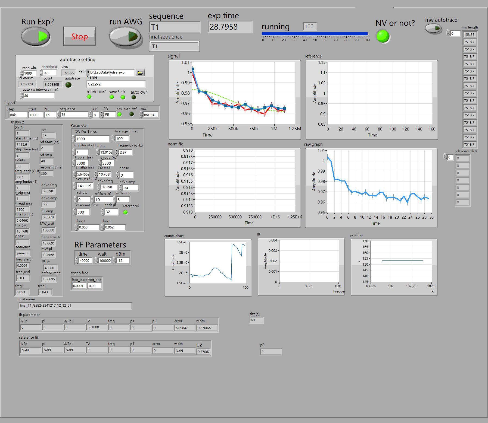

raw_data的结构,以及是如何计算signal_data和reference_data的：

Raw_data文件每一行是一次loop，假设扫描30个点，那么就会有60组，其中,程序在每一组中扫描x秒内的计数，用于归一化,我们需要的是弛豫一段时间后的比例 

那么 

第一组：signal:弛豫到start+step0时刻的计数,autotrace的计数 

第二组：reference:弛豫到start+step0时刻的计数,autotrace的计数,开微波(全光则不开) 

第三组：signal:弛豫到start+step*1时刻的计数，autotrace的计数

……

第59组：signal：弛豫到start+step29时刻的计数，autotrace的计数 

第60组：reference:弛豫到start+step30时刻的计数,autotrace的计数,开微波(全光则不开)

这样60组总共120个数据构成了每一行

实验中设定了一个阈值(下图中的threshold)，如果测定出的数据低于autotrace*threshold，那么将进行一次autotrace,因此，autotrace作为归一化矩阵时，只有重新进行了autotrace才会发生改变

因此数据处理时，我们把raw_data的矩阵先按奇偶列拆开，获得测试数据和归一化矩阵 然后直接相除获得归一化的数据，这个数据的奇数列是signal，偶数列是reference 那么我们还需要取奇数行和偶数行分别得到对应的signal和reference的数据，然后我们按列求均值和方差就得到了在sig-ref中的数据

